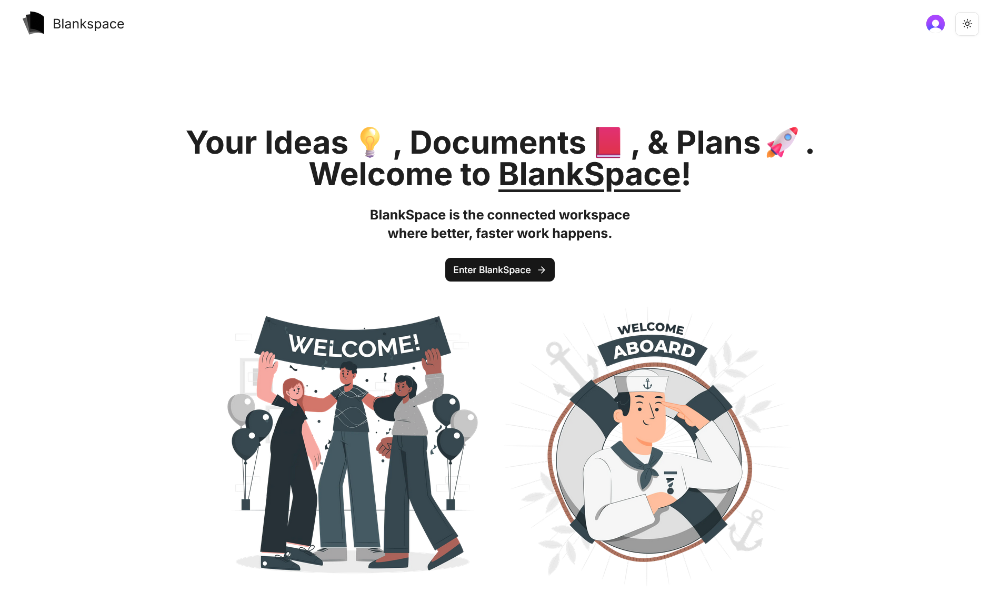

# 🎨 Blankspace (Notion Clone)


<p align="center">
  
</p>

<p align="center">
  A modern collaborative workspace inspired by Notion.
</p>

<p align="center">
  <a href="https://blank-space-tau.vercel.app" style="color: blue"><strong style="color: #FF5154">Live Demo</strong></a> •
  <a href="#-features"><strong style="color: #D1D646">Features</strong></a> •
  <a href="#%EF%B8%8F-getting-started"><strong style="color: #C1DBE3">Getting Started</strong></a>
</p>

---

## 📋 Table of Contents

- [About](#-about)
- [Tech Stack](#%EF%B8%8F-tech-stack)
- [Features](#-features)
- [Getting Started](#%EF%B8%8F-getting-started)
- [Project Structure](#project-structure)
- [License](#-license)
- [Credits](#-credits)
- [Authors](#%EF%B8%8F-authors)

---

## 👋 About

Blankspace is a productivity workspace designed for writing, organizing, and managing documents in a flexible hierarchical structure.

The goal of this project was to build a **modern full-stack application** with real-time capabilities, authentication, cloud file storage, and a scalable architecture.

The application includes **a rich editing experience, nested documents, trash management, cover images, and a command-palette style search** — all wrapped in a fast and responsive interface.

---

## 🛠️ Tech Stack

### 📱 Frontend

- **Next.js**
- **TypeScript**
- **Tailwind CSS**
- **Shadcn/ui**
- **Zustand** (state management)

### 💻 Backend

- **Convex** (database + backend logic)

### 🥸 Authentication

- **Clerk**

### 📂 File Storage

- **EdgeStore**

---

## ✨ Features

Some cool stuff this project can do:

### 📝 Document Editor

- Nested documents
- Cover images
- Real-time updates

### 🔐 Authentication

- Secure login with Clerk
- Protected routes

### 📁 File Storage

- Image uploads with EdgeStore
- Optimized asset delivery

### ⚡ Performance

- Real-time backend with Convex
- Server components with Next.js

---

## ⚙️ Getting Started

Wanna run this locally? Follow these steps:

1. Clone the repo

```bash
git clone https://github.com/Ah-Ibrahim/blank-space.git
cd blank-space

```

2. Install dependencies

```bash
npm install
```

3. Add environment variables

```bash
NEXT_PUBLIC_CLERK_PUBLISHABLE_KEY=
NEXT_PUBLIC_CLERK_SIGN_IN_FORCE_REDIRECT_URL=/documents
NEXT_PUBLIC_CLERK_SIGN_UP_FORCE_REDIRECT_URL=/documents
CLERK_SECRET_KEY=
CLERK_JWT_ISSUER_DOMAIN=
NEXT_PUBLIC_CONVEX_URL=
CONVEX_DEPLOYMENT=
EDGE_STORE_ACCESS_KEY=
EDGE_STORE_SECRET_KEY=

```

4. Start the app

```bash
npm run dev
```

---

## Project Structure

```
./
├── app
│ ├── (marketing)     # Landing page
│ └── (main)          # Authenticated app
│
├── components
│ ├── ui              # Shadcn components
│ ├── modals
│ └── upload
│
├── convex            # Backend functions
├── hooks             # Custom hooks
├── lib               # Utilities
├── providers         # Context providers
├── public            # Static assets
└── proxy.ts
```

---

## 📄 License

This project is licensed under the MIT License.
Feel free to do what you want with it.

---

## 🙏 Credits

Big thanks to:

- [Lucide](https://lucide.dev/) for icons

---

## ✍️ Authors

Ahmed Ibrahim
